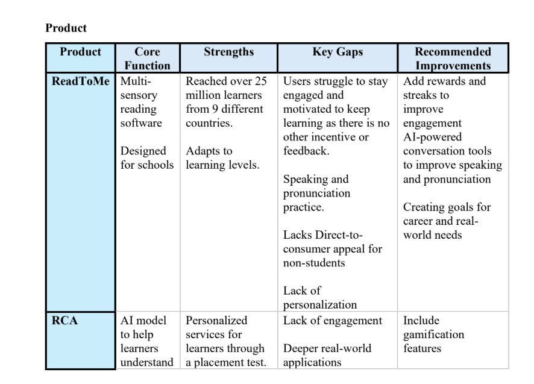
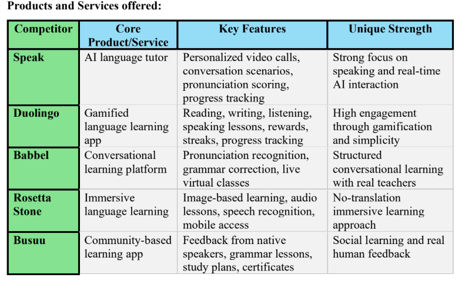
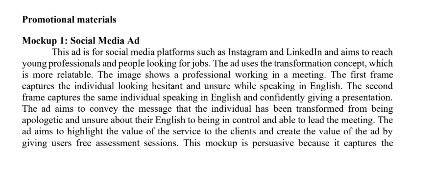
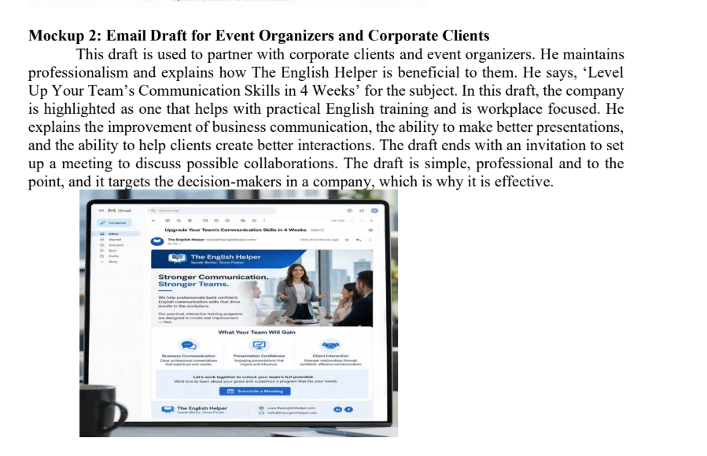
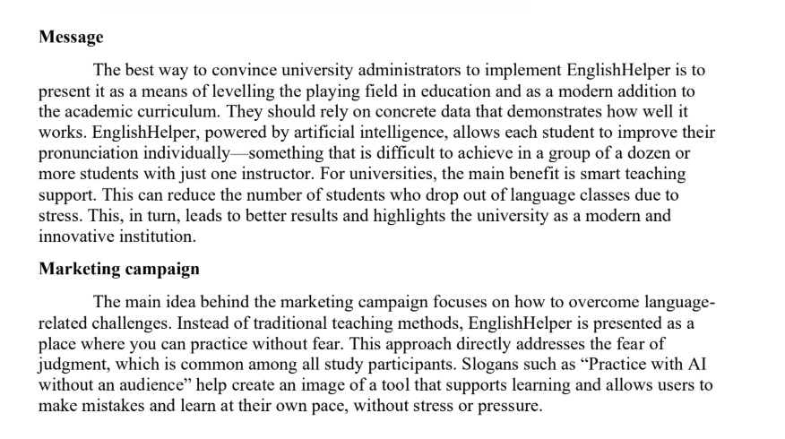

# 🌍 EnglishHelper Global Marketing Strategy — X-Culture Team Project
> *Market Research | Competitor Analysis | Pricing Strategy | Promotion Planning*

Collaborated with an international team across 5 countries to develop a go-to-market strategy for EnglishHelper, an AI-powered EdTech language learning platform. Responsible for SWOT analysis, competitor benchmarking, and in-app advertising strategy. Delivered pricing recommendations, promotion channel strategy, and a full marketing campaign framework targeting students and young professionals aged 16–30.

---

## 📌 Key Highlights
- Conducted SWOT analysis identifying AI personalization as EnglishHelper's core competitive advantage
- Benchmarked 5 competitors: Duolingo, Babbel, Rosetta Stone, Busuu, and Speak
- Recommended freemium pricing model with three tiers: Student Basic (free), Academic Pro ($9.99/mo), Career Expert ($14.99/mo)
- Proposed in-app advertising strategy balancing monetization with user experience
- Identified LinkedIn, YouTube, and SEO as primary promotion channels
- Developed campaign messaging around stress-free, judgment-free AI learning
- Primary research survey (n=50): 61.5% of respondents cited speaking anxiety as their biggest barrier
- Team: X-Culture Team 451 — members from USA, Poland, New Zealand, Egypt, and Brazil

---

## 📄 Full Report
[Download Full Report (PDF)](451.pdf)

---

## 🖼️ Project Screenshots

---

## 👥 Contributors
- **Britnee Bayas** — SWOT Analysis, Benchmark of Competitors, In-App Advertising (USA)
- Natalia Pielecha — Pricing, User Interviews, Market Assets, Survey (Poland)
- Samara Dullabh — Team Leader, Competitors, Market Segment, Promotion Channels (New Zealand)
- Ahmed Hossam Mohamed Bayoumy Ahmed — Business Models, Engagement & Retention, Promotional Materials (Egypt)
- Luca Florio Vianna — Industry and Competition Analysis (Brazil)
